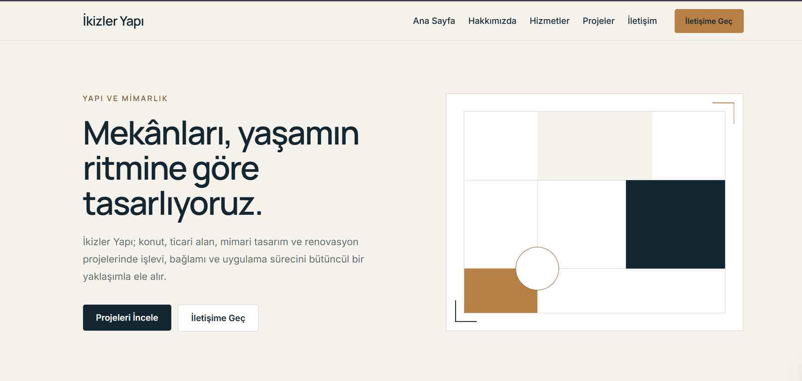
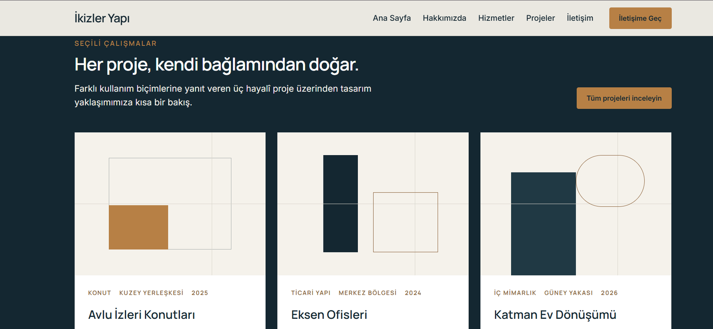
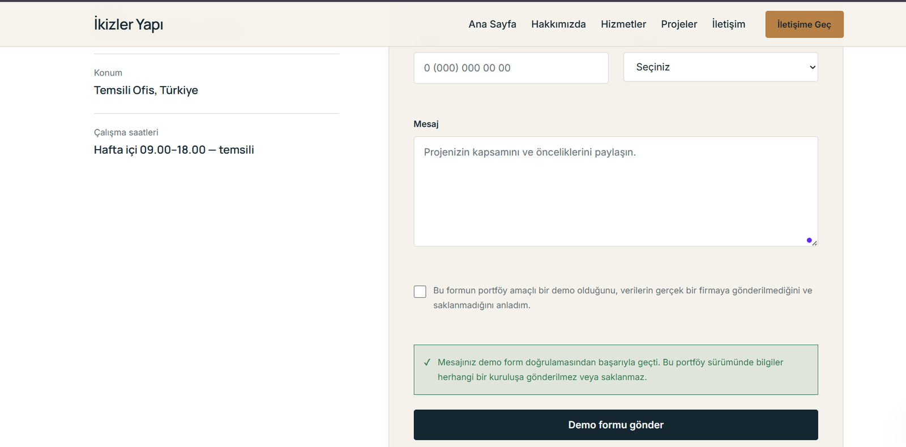
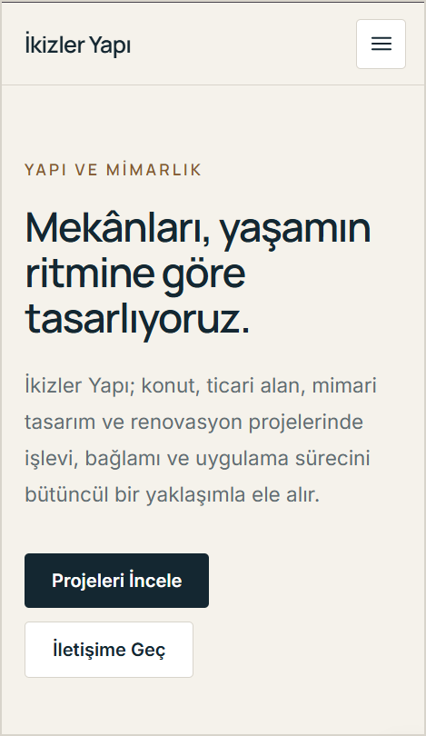

# İkizler Yapı

Next.js, TypeScript ve Tailwind CSS ile geliştirilen; modern, responsive ve erişilebilir hayalî kurumsal yapı ve mimarlık sitesi.

- [Canlı Demo](https://ikizler-yapi.vercel.app)
- [Kaynak Kod](https://github.com/vedatbulucular/ikizler-yapi)

> **Marka uyarısı:** İkizler Yapı, portföy amacıyla oluşturulmuş hayalî bir markadır. Bu proje herhangi bir gerçek şirketi, web sitesini veya marka kimliğini kopyalamaz ve herhangi bir gerçek kuruluşla bağlantılı değildir.

## Proje Hakkında

İkizler Yapı; kurumsal bir inşaat ve mimarlık sitesinin içerik, tasarım sistemi, responsive yerleşim, form doğrulama, SEO ve erişilebilirlik gereksinimlerini tek bir portföy çalışmasında göstermek amacıyla sıfırdan geliştirildi.

Proje; ana sayfa, kurumsal içerik sayfaları, hayalî proje sunumları ve istemci ile sunucu tarafında doğrulanan bir demo iletişim formu içerir. Gerçek firma verisi, müşteri bilgisi veya haricî içerik kullanılmaz.

## Ekran Görüntüleri

### Ana sayfa — masaüstü



### Öne çıkan projeler



### İletişim formu — başarı durumu



### Ana sayfa — mobil



## Öne Çıkan Özellikler

- Farklı ekran boyutlarına uyarlanan responsive kurumsal tasarım
- Next.js App Router mimarisi ve Server Components ağırlıklı yapı
- Klavye ile kullanılabilen, Escape tuşuyla kapanan erişilebilir mobil menü
- Yeniden kullanılabilir layout ve UI bileşenleri
- Merkezi TypeScript veri modelleri ve içerik kaynakları
- İstemci ve sunucu tarafında tekrar doğrulanan demo iletişim formu
- Honeypot, minimum doldurma süresi ve istek boyutu kontrolleri
- Sayfa bazlı özgün metadata ve canonical URL altyapısı
- Open Graph ve Twitter metadata
- `sitemap.xml` ve `robots.txt`
- Tasarım sistemiyle uyumlu özgün 404 sayfası
- Temel güvenlik response header'ları
- Vercel üzerinde production deployment

## Sayfalar

| Rota | Açıklama |
| --- | --- |
| `/` | Hizmetleri, yaklaşımı, seçili projeleri ve çalışma sürecini tanıtan ana sayfa |
| `/hakkimizda` | Hayalî markanın yaklaşımını, misyonunu, vizyonunu ve değerlerini anlatan sayfa |
| `/hizmetler` | Altı uzmanlık alanını ve kapsamlarını sunan hizmetler sayfası |
| `/projeler` | Portföy amacıyla hazırlanmış altı hayalî projeyi listeleyen sayfa |
| `/iletisim` | Temsili iletişim bilgileri ile güvenli demo formunu içeren sayfa |
| `/api/contact` | Yalnızca demo iletişim formunun sunucu tarafı doğrulamasını yapan Route Handler |

## Kullanılan Teknolojiler

- Next.js 16
- React 19
- TypeScript
- Tailwind CSS 4
- ESLint
- Vercel
- Git ve GitHub

## Teknik Mimari

Proje Next.js App Router üzerinde çalışır. Sayfalar ve içerik bölümlerinin büyük bölümü Server Components olarak kalır; Client Components yalnızca mobil menü ve iletişim formu gibi doğrudan etkileşim gereken alanlarda kullanılır.

Ortak arayüz parçaları `src/components` altında, sayfa içeriklerinde kullanılan merkezi veriler `src/data` altında, TypeScript modelleri `src/types` altında tutulur. Metadata ve site URL çözümleme yardımcıları ile form doğrulama kuralları `src/lib` içinde paylaşılır. Demo formun sunucu kontrolü `/api/contact` Route Handler üzerinden yürütülür.

## İletişim Formu ve Güvenlik Yaklaşımı

İletişim formu yalnızca portföy amacıyla doğrulama akışını gösterir:

- Gerçek e-posta göndermez.
- Kullanıcı bilgilerini saklamaz.
- Verileri herhangi bir gerçek firmaya ulaştırmaz.
- İstemci doğrulamasına ek olarak sunucuda yeniden doğrulama yapar.
- Bot benzeri gönderimleri azaltmak için honeypot ve minimum doldurma süresi kontrolü uygular.
- Desteklenmeyen içerik türlerini ve belirlenen sınırı aşan istekleri reddeder.
- API yanıtlarını `Cache-Control: no-store` ile döndürür.

Bu önlemler production iletişim servisi için eksiksiz bir güvenlik garantisi oluşturmaz. Gerçek kullanım öncesinde rate limiting, güvenilir bir e-posta servisi, izleme yaklaşımı ve kişisel veri politikası eklenmelidir.

Uygulama yanıtlarında ayrıca `X-Content-Type-Options`, `Referrer-Policy`, `X-Frame-Options` ve sınırlı `Permissions-Policy` başlıkları bulunur.

## SEO ve Erişilebilirlik

- Her genel sayfa için özgün title, description ve canonical URL
- Open Graph ve Twitter kart metadata'ları
- Dinamik üretilen özgün Open Graph görseli ve favicon
- Genel rotaları listeleyen sitemap ve API yolunu dışarıda bırakan robots yapılandırması
- Türkçe dil bildirimi ve anlamlı landmark yapısı
- Sayfa başına tek ana başlık ve mantıklı başlık sırası
- Klavye odağı görünürlüğü ve “Ana içeriğe geç” bağlantısı
- Form alanlarında label, `aria-invalid`, `aria-describedby` ve canlı durum mesajları
- `aria-expanded` ve `aria-controls` kullanan, Escape ile kapanan mobil menü
- Reduced motion tercihini gözeten hareket ayarları

Bu maddeler erişilebilirliği destekleyen uygulama kararlarını açıklar; belirli bir uygunluk sertifikası iddiası taşımaz.

## Yerel Kurulum

Node.js 20.9 veya daha güncel bir sürüm ile Windows PowerShell üzerinde:

```powershell
git clone https://github.com/vedatbulucular/ikizler-yapi.git
cd ikizler-yapi
npm install
npm run dev
```

Uygulama varsayılan olarak [http://localhost:3000](http://localhost:3000) adresinde açılır.

Production kontrolleri:

```powershell
npm run lint
npm run build
```

## Kullanılabilir npm Komutları

| Komut | Amaç |
| --- | --- |
| `npm run dev` | Yerel geliştirme sunucusunu başlatır |
| `npm run lint` | ESLint denetimini çalıştırır |
| `npm run build` | Production build oluşturur |
| `npm run start` | Önceden oluşturulmuş production build'i çalıştırır |

## Ortam Değişkenleri

`SITE_URL` isteğe bağlıdır ve metadata, canonical URL, sitemap ile robots adreslerinin temel origin değerini belirlemek için kullanılabilir:

```env
SITE_URL=http://localhost:3000
```

Değişken tanımlanmazsa uygulama önce Vercel'in `VERCEL_PROJECT_PRODUCTION_URL`, ardından `VERCEL_URL` sistem değişkenlerini kullanabilir. Yerel geliştirmedeki son fallback `http://localhost:3000` adresidir. Bu projede API anahtarı veya gizli ortam değişkeni gerekmez.

## Proje Klasör Yapısı

```text
ikizler-yapi/
├── docs/
│   └── screenshots/     # README ve portföy ekran görüntüleri
├── public/              # Statik dosyalar
└── src/
    ├── app/             # App Router sayfaları, metadata ve Route Handler
    ├── components/      # Layout, UI, form ve sayfa bileşenleri
    ├── data/            # Merkezi içerik verileri
    ├── lib/             # Doğrulama, metadata ve URL yardımcıları
    └── types/           # Paylaşılan TypeScript modelleri
```

## Deployment

Canlı uygulama Vercel üzerinde çalışır ve GitHub deposunun `main` branch'inden deploy edilir. Vercel proje entegrasyonu etkin olduğunda `main` branch'ine merge edilen değişiklikler otomatik olarak yeniden yayınlanabilir.

Özel domain kullanılacaksa `SITE_URL` değeri production origin adresine ayarlanmalı; deployment sonrasında canonical, sitemap, robots ve Open Graph URL'leri yeniden kontrol edilmelidir.

## Bilinen Sınırlar

- Firma, ekip, projeler, yorumlar ve iletişim bilgileri hayalîdir.
- İletişim formu gerçek e-posta göndermez.
- Veritabanı, CMS, üyelik veya yönetim paneli yoktur.
- Projenin ilk sürümü Türkçe ve tek dillidir.
- Rate limiting ve gerçek e-posta teslimatı uygulanmamıştır.
- Proje fotoğrafları yerine özgün CSS tabanlı geometrik kompozisyonlar kullanılmıştır.

## Gelecekte Eklenebilecek Geliştirmeler

- Rate limiting ve güvenilir e-posta teslimat servisi
- Açık kişisel veri ve gizlilik politikası
- İçerik yönetimi için CMS entegrasyonu
- Çok dilli içerik altyapısı
- Kullanım hakkı doğrulanmış gerçek proje görselleri
- Production ortamında düzenli performans ve erişilebilirlik ölçümleri

## Lisans Durumu

Bu proje için henüz ayrı bir açık kaynak lisansı tanımlanmamıştır.
